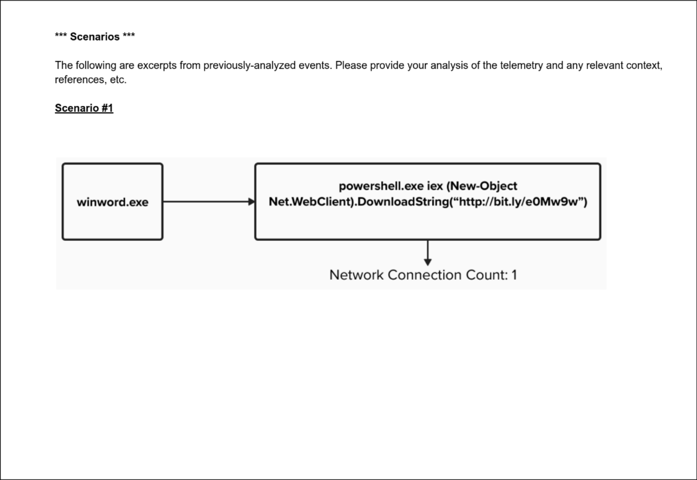

# Scenario 1 Analysis: winword.exe → powershell.exe → Bitly URL



## Executive summary to customer

This telemetry shows a high-confidence malicious activity where a Word document triggered a PowerShell script to download and likely execute code from the internet. This is consistent with phishing-delivered macro malware.

We recommend immediate containment of the endpoint, full memory and disk triage to assess lateral movement or credential theft, and preservation of forensic artifacts. If unauthorized tools or credentials were accessed, rotate them and conduct scope analysis across the environment.

Longer term, consider disabling PowerShell for non-technical users, enabling AMSI logging, and blocking macro execution in Office documents unless signed or from trusted sources

## 🧠 What happened:

   - `winword.exe` (Microsoft Word) spawned `powershell.exe`, which executed an `iex (Invoke-Expression)` command.

   - The PowerShell command used `New-Object Net.WebClient` to **download and execute** a remote script from a shortened **bit.ly URL**.

   - This indicates **malicious macro activity** — a **common initial access technique** used in phishing campaigns.

## 🚨 Why it matters (threat context):

   - This behavior aligns with **MITRE ATT&CK T1059.001 – PowerShell** and **T1566 – Phishing.**

   -  Use of `Invoke-Expression` combined with a URL shortener suggests:

       -  Obfuscation/evasion

        - Attempt to **hide the payload origin**

   - Network connection indicates **active download of secondary payload**, likely a malware loader or infostealer.

## ✅ Detection / Prevention Improvements:

   - Alert on parent-child process chains like: ```winword.exe → powershell.exe```

   - Block or log use of `Invoke-Expression`, `DownloadString`, or known LOLBins

   - Monitor or outright block URL shorteners in the proxy/firewall

   - Enable enhanced PowerShell logging (ScriptBlock, Module, Transcription)
