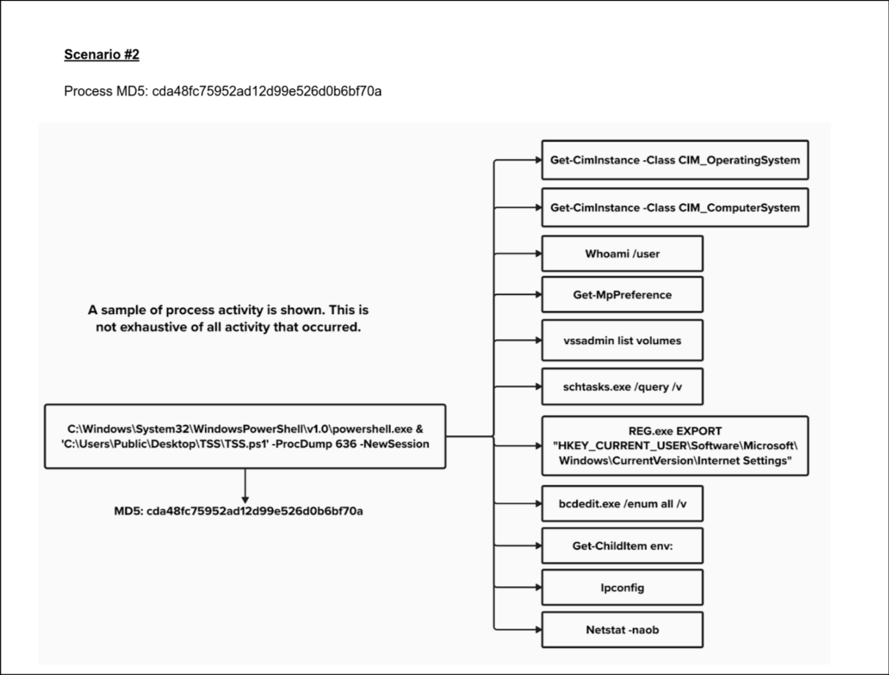

# Scenario 2 — Persistence/Enumeration

## Executive summary to customer
We observed execution of a PowerShell-based diagnostic script that initiated a range of suspicious system and network discovery commands. The activity included attempts to extract memory, export system configuration data, and enumerate network details — all behaviors consistent with post-compromise reconnaissance.

This behavior indicates a high likelihood of attacker presence on this endpoint. Immediate containment is recommended to prevent lateral movement. We suggest collecting a memory image, identifying PID 636 for analysis, and reviewing scheduled tasks and registry changes. Consider credential resets and a full reimage if any sensitive data is confirmed exposed.

## 🧠 What Happened:

A PowerShell script (`TSS.ps1`) located in a public user directory was executed with the `-ProcDump` parameter, targeting PID 636. This script launched reconnaissance commands and exported registry data. The script is unsigned, ran under `NewSession`, and exhibited behavior consistent with post-exploitation enumeration.

## 🔍Analyst Interpretation (CIRT Perspective):

 - **Execution Method:**

    PowerShell was used to invoke a local script from `C:\Users\Public\Desktop`, which is a known location abused for lateral staging and persistence due to its broad write access.
    The use of `-ProcDump` suggests memory dumping (PID 636 may correspond to LSASS or another target of credential theft).

   - **Recon Activity (Post-Exploitation Tactics):**

       - `Get-CimInstance` (OS and system metadata)

       - `whoami /user` (current SID and user context)

       - `Get-MpPreference` (Defender configuration – e.g., exclusions, real-time protection)

       - `vssadmin list volumes` (volume shadow copy access – likely pre-ransomware prep)

       - `schtasks /query /v` (scheduled tasks for persistence opportunities)

       - `REG EXPORT` of Internet Settings (possibly proxy configs or C2 comms)

       - `bcdedit /enum all /v` (bootloader config – rare, possibly anti-forensics or EDR evasion prep)

       - `Get-ChildItem env:` (enumerating environment variables – e.g., PATH, user-specific info)

       - `ipconfig` and `netstat -naob` (host/network situational awareness and live connection mapping)

## ⚠️ Severity and Risk:

   - **High** — Evidence of manual or automated post-exploitation activity.

   - Staging of tools in a public directory, privilege context unknown (but likely user-level unless escalation occurred).

   - Potential for credential dumping, network mapping, and C2 beaconing.

   - Persistence, exfiltration, or ransomware likely to follow.

## 🔄 Remediation Recommendations:

   - Isolate the host immediately

   - Review PID 636 to determine what process was dumped (e.g., LSASS → credential theft)

   - Investigate script origin and access logs for `TSS.ps1`

   - Rotate credentials, especially if LSASS was involved

   - Hunt for lateral movement activity using `netstat` and shared folder logs

   - Check for persistence mechanisms (scheduled tasks, registry autoruns)
