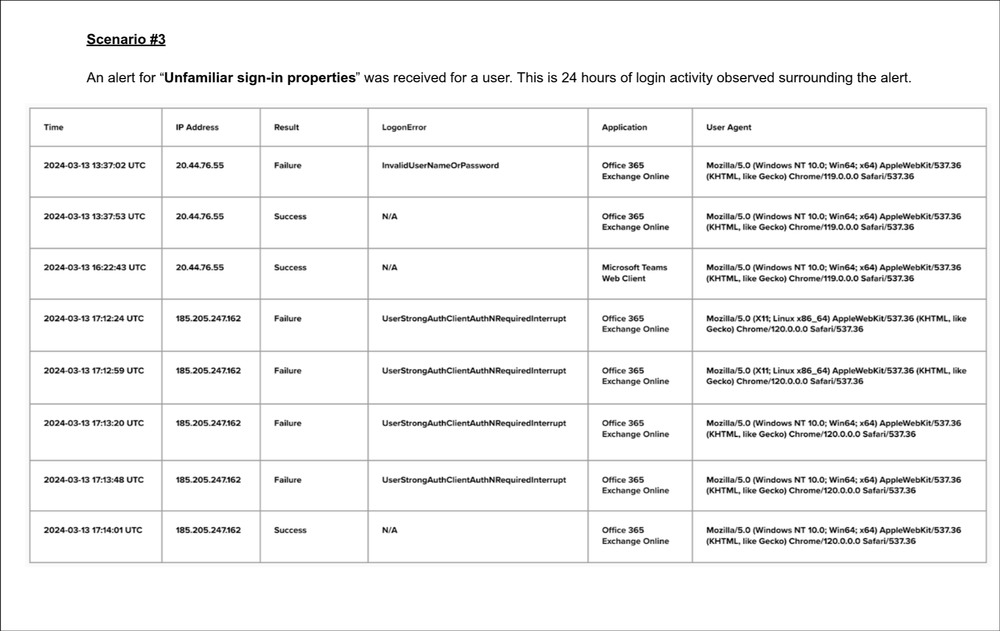

# Scenario 3: Unfamiliar Sign-In Properties — Analysis & Customer Narrative

## Executive summary to customer

We observed a successful login to your Office 365 account from a suspicious IP address (`185.205.247.162`) using a Linux browser — a clear deviation from your normal behavior. Prior to this, four failed logins were recorded due to MFA challenges, followed by a successful login. This strongly suggests your credentials and second factor were compromised — potentially through phishing, session hijack, or device compromise.

## 🧠 What We’re Seeing

   -  A user logged in successfully from **IP** `20.44.76.55`, using **Windows/Chrome.**

   - ~3.5 hours later, **5 consecutive login attempts** from `185.205.247.162`, a **Linux/Chrome** user agent:

       - 4 failures (`UserStrongAuthClientAuthNRequiredInterrupt`).

       - Then a **success on 5th attempt.**

   - The alert was generated due to **unfamiliar sign-in properties**, triggered by deviation from baseline (geo, platform, or agent).

## 🚨 Key Red Flags

   - **Different OS / Browser fingerprint** (Windows → Linux).

   - **Different geo-IP ranges** (based on IP whois).

   - **Multiple MFA challenges** followed by success → suggests **valid creds + valid second factor** were available.

        - Implies **token/session hijack, device theft, or phishing kit** with real-time proxy.

   - **No failures from legit user post-compromise** (silent takeover possible).

## ✅ Recommended Actions

   1. Immediate Containment

        - Disable the account.

        - Force global password reset.

        - Invalidate current MFA tokens (reset authenticator apps, FIDO keys, etc.).

   2. Investigative Follow-Up

        - Check mailbox rules, logins, and mail forwarding.

        - Review lateral movement or elevation using these creds.

        - Correlate with phishing campaigns, fake login portals, or token theft.

   3. Hardening Measures

        - Enforce conditional access (location-aware, device-based).

        - Geo-block non-approved IP ranges.

        - Monitor for repeat activity.

   4. User Support

        - If user reused password elsewhere: coach on unique passwords + password manager.

        - Provide short, actionable security awareness message — no blame, just clarity:

            “Attackers are now using phishing kits that steal both passwords and MFA codes in real time. Even if you entered your code, it may have been intercepted.”

## 🔍 Bonus (For the Panel)

   - The `UserStrongAuthClientAuthNRequiredInterrupt` is a dead giveaway that the **attacker got stuck on the MFA prompt** — and eventually succeeded.

   -  Could suggest either:

        - Phishing **with real-time reverse proxy** (e.g., Evilginx, Muraena).

        - **Man-in-the-middle of SMS/OTP** if user had weak MFA.

        - **Session replay** if tokens were stolen.
