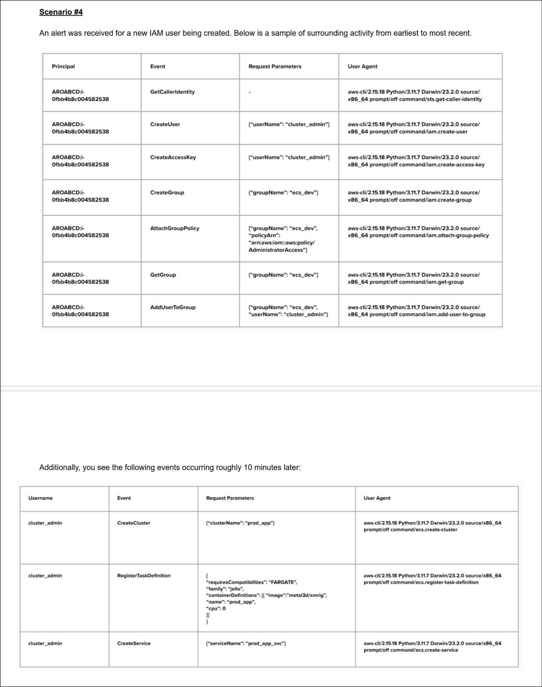

# Scenario 4 Analysis — Crypto Mining via Compromised AWS Access

## Executive summary to customer

It looks like someone gained unauthorized access to your AWS environment using a root-level key. They created a new user and group, granted full admin rights, and then deployed a cryptocurrency miner disguised as a production service. This type of attack is known as cryptojacking, and it's designed to steal your computing power for profit. We're containing the threat by revoking credentials and terminating the malicious workload. We’ll also work with your team to understand how the credentials were compromised and prevent this from happening again

## What Happened

A series of AWS CLI actions indicate a likely **compromise of root credentials:**

   - `GetCallerIdentity` with `-` parameters suggests the attacker authenticated with a **root key**.

   - Immediately after, a new IAM user (`cluster_admin`) and group (`ecs_dev`) were created.

   - Admin rights were granted via the **AdministratorAccess** policy — a classic privilege escalation and persistence tactic.

   - About 10 minutes later, that user:

        - Created an ECS cluster named `prod_app`.

        - Registered a task using the `xmrig` Monero miner image.

        - Deployed the task as a service — activating cryptojacking.

This sequence matches known cryptojacking patterns:

   - **Create new IAM identity** to avoid detection on existing accounts.

   - **Mask activity** with benign-looking group/user names (ecs_dev, prod_app).

   - **Deploy miner** in a way that scales with compute resources (Fargate).

## Risk Level: Critical

   - **Root keys** appear exposed — highest privilege.

   - **Cryptominer deployed** — financial and reputational damage likely.

   - **Evasion attempt failed** — names were plausible, but the image (xmrig) reveals intent.

   - **Cloud costs can spiral** rapidly due to miner sprawl.

## Recommended Remediation

   1. **Immediate containment**

        - **Revoke ALL AWS keys** (including root).

        - **Disable all newly created IAM users and roles.**

        - **Terminate ECS clusters/services** running unauthorized workloads.

   2. **Credential hygiene & audit**

        - Identify source of exposure (e.g., GitHub leak, .env file, vendor compromise).

        - Rotate all secrets using AWS Secrets Manager.

        - Enforce MFA across all users (including root).

   3. **Hardening**

        - Monitor for `GetCallerIdentity` with root usage — high-fidelity IOC.

        - Set up anomaly detection on IAM create/update events.

        - Review unused access keys and enforce key rotation policies.

        - Apply least privilege on IAM — no blanket `AdministratorAccess`.
