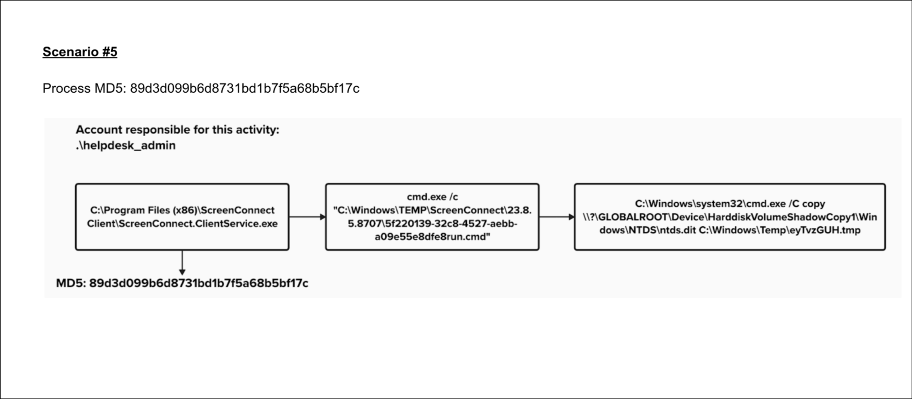

# Scenario 5 – NTDS.dit Extraction via ScreenConnect

## Executive summary to customer

We identified suspicious activity originating from the helpdesk_admin account, where a ScreenConnect remote session executed a command to copy the NTDS.dit file via Volume Shadow Copy — a known tactic used for credential dumping. While the action was performed under a legitimate account, this is not standard behavior and strongly suggests credential compromise or potential insider misuse. We immediately disabled the account, isolated the host, and launched a forensic investigation. No confirmed data exfiltration has occurred at this time, but we advise rotating administrative credentials, reviewing remote access policies, and auditing for any similar activity across your environment. A full incident report and remediation guidance will follow.

## Summary:

The `helpdesk_admin` account launched a ScreenConnect service that ultimately executed a command to copy the **NTDS.dit** file from a Volume Shadow Copy. This strongly indicates either:

- **Compromised credentials** (external threat actor abusing remote support software), or

- **Insider threat activity** (authorized admin misusing access).

## Key Indicators of Malicious Activity:

- **Process Chain:**

  - `ScreenConnect.ClientService.exe` → launches `.cmd` script in TEMP → executes a copy of `ntds.dit` from `HarddiskVolumeShadowCopy1`.

- **What is NTDS.dit?**

  - The **Active Directory database** that contains **hashed user credentials**, including domain admin hashes — **prime target** for credential dumping.

- **Use of VSS path:**

  - Copying from `GLOBALROOT\Device\HarddiskVolumeShadowCopy` shows attacker knows:

    - `ntds.dit` is locked during runtime,

    - Shadow copies **bypass file lock** — a classic red team move.
- **Execution via Remote Tool:**

    - ScreenConnect is often used legitimately, but it’s **abused in post-exploitation** to blend in and avoid detection.

    - Abuse of trusted tools = “**Living off the land” (LotL) technique.**

## Likely Scenarios:

1. **External Threat:**

    - Attacker gained `helpdesk_admin` creds and RDP'd in or accessed via VPN.

    - Used ScreenConnect (maybe pre-installed) to stay low-profile.

    - Goal: Steal `ntds.dit`, extract hashes offline, then **privilege escalate.**

2. **Insider Threat:**

    - Legit helpdesk_admin with malicious intent or working with attacker.

    - Already has permissions, masking intent via benign software.

## Next Steps (IR & Remediation):

- ✅ **Immediate Containment:**

    - Disable `helpdesk_admin` account.

    - Kill any active ScreenConnect sessions.

    - Isolate the host.

- 🔍 **Investigate Scope:**

    - When was ScreenConnect installed?

    - Who accessed the machine? From what IP?

    - Are any `.tmp` or `.dit` files exfiltrated?

    - Were hashes dumped and used for lateral movement (Golden Ticket, Pass-the-Hash, etc)?

- 🧠 Root Cause Analysis:

    - Was ScreenConnect misconfigured or maliciously deployed?

    - Audit all admin accounts: reuse, MFA, unusual behavior.

- 🧰 Preventative Actions:

    - Enforce **MFA on all admin accounts.**

    - Rotate credentials.

    - Deploy **Honey tokens** for NTDS.dit access attempts.

    - Alert on **Volume Shadow Copy + ntds.dit** access attempts.
